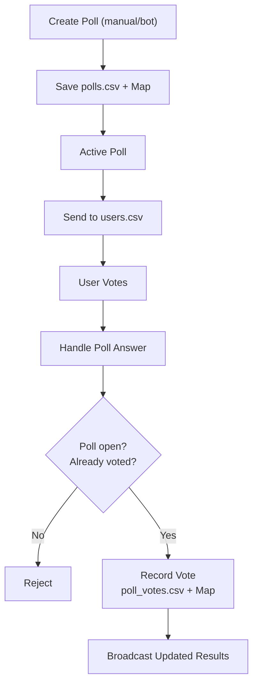

# 📊 Survey Bot – Smart, Simple & Interactive  

## 🚀 What is this project?  
Survey Bot is a **smart survey system** that combines **AI-generated questions**, a **Telegram bot**, and a **modern Swing UI** – all working together to make surveys effortless, interactive, and fun.  

## ✨ Features at a Glance  
- 🤖 **AI-powered survey generation** – create smart questions automatically.  
- 💬 **Telegram integration** – distribute surveys directly to your community.  
- 🎨 **Modern UI (Swing)** – manage surveys with rounded, transparent panels.  
- 📈 **Analytics dashboard** – track responses in real-time and view trends.  
- 💾 **CSV storage** – lightweight and easy export of survey results.  

## 🛠️ How it Works  
1. **AI Module** suggests questions & answers.  
2. **Survey Object** is created and passed to the Bot.  
3. **Bot** sends surveys to clients on Telegram.  
4. **Clients** respond, and data flows back.  
5. **View (Swing)** shows live updates.  
6. **Analytics** aggregates results into clean insights.  

## 🖼️ System Flow  

## 🧑‍💻 Tech Stack  
- **Java (Swing, OOP, Multithreading)**  
- **Telegram Bot API**  
- **CSV file storage**  

## 🌟 Why this project?  
Because surveys don’t have to be boring. With **AI + UI + Analytics**, you get:  
✔️ Easy creation  
✔️ Instant delivery  
✔️ Real-time tracking  

---

🔥 Perfect for communities, research groups, or anyone who wants to collect feedback in style.  
